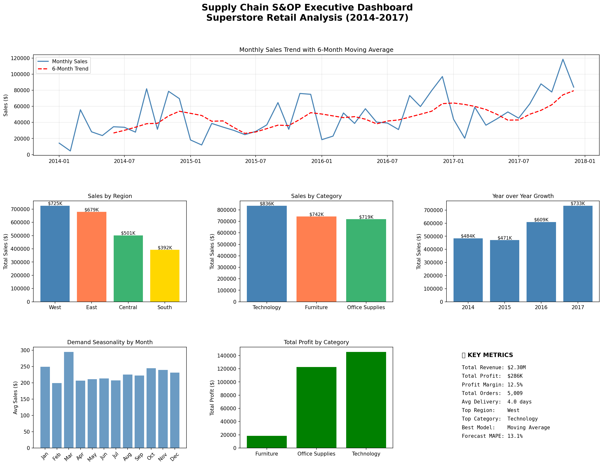

# Supply Chain Demand Analysis 📦

> An end-to-end supply chain demand forecasting and S&OP analysis pipeline built with Python, simulating real-world enterprise planning workflows used in platforms like o9 Solutions.



---

## 🎯 Project Objective

Replicate key supply chain planning concepts — ETL, Demand Management, Time Series Forecasting, and S&OP reporting — using real retail sales data.

---

## 📊 Key Results

| Metric | Value |
|--------|-------|
| 📦 Total Revenue | $2.30M |
| 💰 Total Profit | $286K |
| 📈 Profit Margin | 12.5% |
| 🛒 Total Orders | 5,009 |
| 🚚 Avg Delivery Days | 4.0 days |
| 🔮 Best Forecast Model | Moving Average |
| 🎯 Forecast MAPE | 13.1% |
| 📅 Date Range | 2014 – 2017 |

---

## 🗂️ Project Structure
```
scd-analysis/
├── data/
│   ├── Sample - Superstore.csv      ← raw data (9,994 records)
│   └── superstore_cleaned.csv       ← ETL output
├── notebooks/
│   ├── 01_ETL_Pipeline.ipynb        ← Extract Transform Load
│   ├── 02_Demand_Analysis.ipynb     ← 7 demand charts
│   ├── 03_Forecasting_Models.ipynb  ← MA & ES models
│   └── 04_SOP_Dashboard.ipynb       ← Executive dashboard
├── outputs/                         ← 10 saved charts
├── src/
│   └── etl_pipeline.py              ← reusable ETL script
└── README.md
```

---

## 🔑 Supply Chain Concepts Covered

| Concept | Implementation |
|---------|---------------|
| ETL Pipeline | Data ingestion, cleaning, transformation |
| Demand Management | Trend analysis, seasonality detection |
| S&OP Planning | Regional & category demand breakdown |
| Time Series Analysis | Rolling averages, trend identification |
| Demand Forecasting | Moving Average, Exponential Smoothing |
| Forecast Accuracy | MAE and MAPE error metrics |
| Supply Chain KPIs | Delivery days, profit margin, order volume |

---

## 🛠️ Tech Stack


---

## 📈 Key Business Insights

- 🌍 **West region** leads with **$725K** in total sales
- 💻 **Technology** category drives highest revenue at **$836K**
- 📅 **March** is peak demand month — suggests B2B buying cycles
- 📈 Sales grew **51%** from 2014 to 2017
- 🪑 **Furniture** has lowest profit margin despite high sales
- ⚠️ **Central region** flags pricing issue — lowest avg profit ($17)
- 🚚 Average delivery time is **4.0 days** across all regions

---

## 🔮 Forecasting Results

| Model | MAPE | Result |
|-------|------|--------|
| Moving Average (3-month) | 13.1% | 🏆 Winner |
| Exponential Smoothing | 35.5% | — |

> Moving Average outperformed Exponential Smoothing because the data has high monthly volatility without a strong consistent trend.

---

## ▶️ How to Run
```bash
# Clone the repo
git clone https://github.com/devayan279/scd-analysis
cd scd-analysis

# Install dependencies
pip install pandas numpy matplotlib seaborn statsmodels jupyter

# Launch Jupyter
jupyter notebook

# Run notebooks in order
# 01 → 02 → 03 → 04
```

---

## 👤 Author

**Devayan Das**
B.Tech Civil Engineering | NIT Agartala

[](https://linkedin.com/in/devmoon)
[](https://github.com/devayan279)
